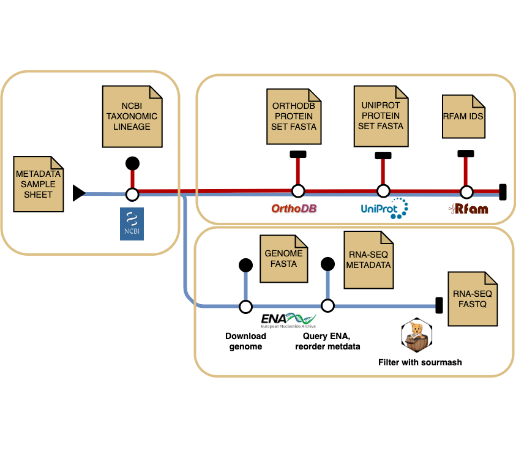

# Introduction

**ebi-metagenomics/datascout** is a pipeline to query and fetch protein, RNA and transcriptomic evidence to support eukaryotic gene annotation, from different data archives: European Nucleotide Archive (ENA), Rfam, UniProt and OrthoDB
 
The pipeline allows for bespoke requests such as specificity of taxonomic rank queried, evidence levels and volume of outputs.

The steps of the pipeline are outlined in the [documentation](docs/README.md).

> [!NOTE]
> This pipeline uses the [nf-core](https://nf-co.re) template with some tweaks, but it's not part of nf-core.

# Pipeline steps

The datascout pipeline is split into the following steps:

<p align="center">
    
</p>

## Step 1. Construct taxonomic lineage

Uses NCBI taxdump to construct taxonomic lineages using [ete toolkit](https://github.com/etetoolkit/ete), ignoring any ranks labelled as "no rank"

## Step 2. OrthoDB

Query OrthoDB for clusters matching the most specific possible taxid OR the given rank in the samplesheet.
Creates a combined protein fasta file for a cluster.

Uses the following filters:
"universal": "0.9",
"singlecopy": "0.9"

## Step 3. UniProt

Query UniProt for proteins matching the most specific possible taxid OR the given rank in the samplesheet.
Created a protein fasta file with simplifed headers.

Uses user provides filters:
Evidence level 1 = Experimental evidence at protein level
Evidence level 2 = Experimental evidence at transcript level OR above
Evidence level 3 = Protein inferred from homology OR above

Results are filtered for swissprot only entries if the the input flag is used.

## Step 4. Rfam

Query Rfam for models matching the most specific possible taxid OR the given rank in the samplesheet.
Outputs a list of Rfams.

This step uses the [credentials](assets/rfam_db.conf) for the public Rfam database

## Step 5. ENA and transcriptomes

This step groups values in samplesheet data by genome_id and ena_tax to avoid download duplicate sets of reads for the same genome.
Per grouping it queries ENA for transcriptomic reads matching the most specific possible taxid OR the given rank (ena_tax) in the samplesheet.

The results are reordered with the following critera to try and download the most diverse set of reads possible (i.e. not all reads from the same sample/study):
- Check data is paired and with two files
- filter short sequences read length <75
- sort by descending base count 
- group by sample name and cycle through alternating the names

Downloads fastq files for the used specified number of max runs and uncompresses the files

## Step 6 (optional). Sourmash subworkflow

Check containment of the downloaded reads in the genome (both sketches).
Filter only runs which contribute >= 1% unique kmers mapped to the genome in the output.

# Usage

Pipeline help:

```angular2html
Typical pipeline command:

USAGE:
  nextflow run main.nf --samplesheet <file> [options]

REQUIRED INPUT/OUTPUT OPTIONS:
  --samplesheet <file>    Path to comma-separated file (CSV/TSV/YAML) containing
                          information about the samples and genomes.
                          You will need to create this before running the pipeline.

OPTIONAL INPUT/OUTPUT OPTIONS:
  --outdir <dir>          The output directory where the results will be saved.
                          [default: results]

DATABASE OPTIONS:
  --taxdump <file>        Path to NCBI taxonomy dump file. Will be downloaded if not provided.
                          Used for taxonomic lineage parsing.
  --sqlite <dir>          Path to NCBI sqlite database. Will be downloaded if not provided.
                          Used for taxonomic lineage parsing.
  --rfam_db <file>        Path to the latest available public Rfam database connection config.
                          [default: ${projectDir}/assets/rfam_db.txt]
                          Used for RNA family searches.

PROCESSING OPTIONS:
  --max_runs <int>        Maximum number of runs to process.
                          [default: 100, min: 1, max: 10000]
  --sourmash              Enable sourmash filtering.
                          Uses sourmash for sequence similarity filtering instead of
                          direct FASTQ download. [default: false]
  --swissprot             Use SwissProt database only.
                          Restricts UniProt searches to manually curated entries. [default: false]
```

# Samplesheet

The samplesheet is a comma separated file with the following columns. Please include a blank field for the optional columns even if they are unused.
You can use the [example samplesheet](assets/samplesheet.csv) to guide you.

Required columns 

| Column      | Type    | Description                                                                  |
| ----------- | ------- | ---------------------------------------------------------------------------- |
| `sample_id` | string  | Unique identifier for the sample. Each sample must have a distinct ID.       |
| `genome`    | string  | Genome assembly accession (e.g. `GCA_003719455.1`) for the submitted genome. |
| `taxid`     | integer | NCBI taxonomy ID corresponding to the genome.                                |

Optional columns

| Column             | Type    | Default   | Description                                                              |
| ------------------ | ------- | --------- | ------------------------------------------------------------------------ |
| `orthodb`          | string  | `default` | Maximum taxonomic level to use for OrthoDB queries.                      |
| `uniprot`          | string  | `default` | Preferred taxonomic level for UniProt queries.                           |
| `rfam`             | string  | `default` | Preferred taxonomic level for RFAM RNA family searches.                  |
| `ena`              | string  | `default` | Preferred taxonomic level for ENA transcriptome data.                    |
| `uniprot_evidence` | integer | `2`       | Minimum UniProt evidence level (higher = more reliable, but fewer hits). |
| `assembly_file`    | string  | —         | Path to an existing genome FASTA file (skips download if provided).      |

# Outputs

The outputs of the pipeline are as follows:
```
results
├── GCA_003719455.1_default_rna_fastq_dir
│   ├── SRR32368313_1.fastq
│   └── SRR32368313_2.fastq
├── GCA_003719455.1_ENA_filtered_rna.csv
├── GCA_003719455.1_reheaded_assembly.fasta
├── pipeline_info
│   ├── execution_report.html
│   ├── execution_timeline.html
│   ├── execution_trace.txt
│   ├── pipeline_dag.svg
│   └── software_versions.yml
├── test_sample1_orthodb_dir
│   └── 5690_sequences
│       └── combined_orthodb_5690.faa
├── test_sample1_rfam_dir
│   └── rfam_ids.txt
├── test_sample1_tax_ranks.tsv
├── test_sample1_uniprot_dir
│   ├── 5693_uniprot_proteins.faa
│   └── 5693_uniprot_raw.faa
├── test_sample2_orthodb_dir
│   └── 5690_sequences
│       └── combined_orthodb_5690.faa
├── test_sample2_rfam_dir
│   └── rfam_ids.txt
├── test_sample2_tax_ranks.tsv
└── test_sample2_uniprot_dir
    ├── 5654_uniprot_proteins.faa
    └── 5654_uniprot_raw.faa
```
