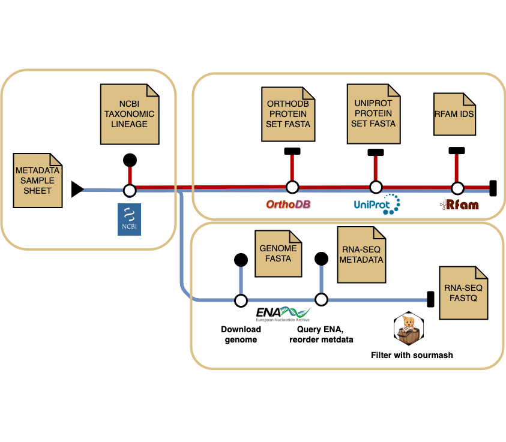

# ebi-metagenomics/datascout: Documentation

The datascout pipeline is split into the following steps:

    

## Step 1. Construct taxonomic lineage

Uses NCBI taxdump to construct taxonomic lineages using [ete3], ignoring any ranks labelled as "no rank"

## Step 2. OrthoDB

Query OrthoDB for clusters matching the most specific possible taxid OR the given rank in the samplesheet.
Creates a combined protein fasta file for a cluster.

Uses the following filters:
"universal": "0.9",
"singlecopy": "0.9"

## Step 3. UniProt

Query UniProt for proteins matching the most specific possible taxid OR the given rank in the samplesheet.
Created a protein fasta file with simplifed headers.

Uses user provides filters:
Evidence level 1 = Experimental evidence at protein level
Evidence level 2 = Experimental evidence at transcript level OR above
Evidence level 3 = Protein inferred from homology OR above

Results are filtered for swissprot only entries if the the input flag is used.

## Step 4. Rfam

Query Rfam for models matching the most specific possible taxid OR the given rank in the samplesheet.
Outputs a list of Rfams.

This step uses the [credentials](../assets/rfam_db.conf) for the public Rfam database

## Step 5. ENA and transcriptomes

This step groups values in samplesheet data by genome_id and ena_tax to avoid download duplicate sets of reads for the same genome.
Per grouping it queries ENA for transcriptomic reads matching the most specific possible taxid OR the given rank (ena_tax) in the samplesheet.

The results are reordered with the following critera to try and download the most diverse set of reads possible (i.e. not all reads from the same sample/study):
- Check data is paired and with two files
- filter short sequences read length <75
- sort by descending base count 
- group by sample name and cycle through alternating the names

Downloads fastq files for the used specified number of max runs and uncompresses the files

## Step 6 (optional). Sourmash subworkflow

Check containment of the downloaded reads in the genome (both sketches).
Filter only runs which contribute >= 1% unique kmers mapped to the genome in the output.

